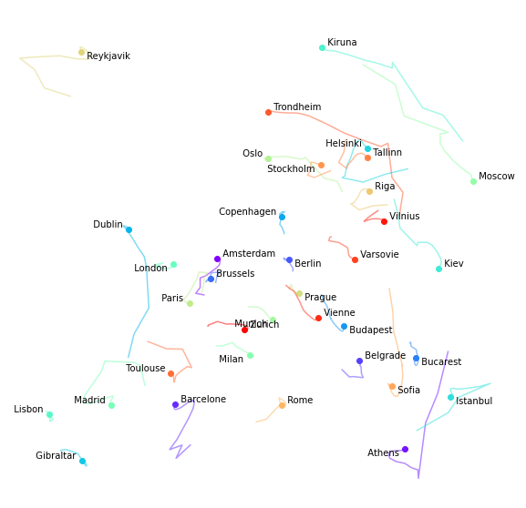
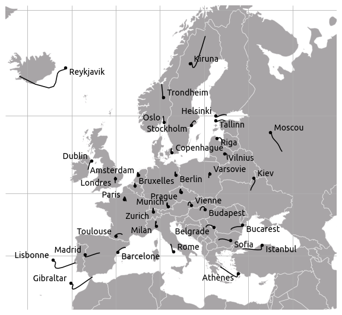
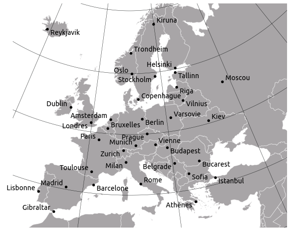

# Solve the city placement problem

[« Previous](.) \| [Up ↑](.) \| [Next »](../3_pytorch/)

Let's write the map reconstruction problem in a form that can be fed to an optimization solver. For this we will use the [`scipy.optimize`](https://docs.scipy.org/doc/scipy/reference/optimize.html#module-scipy.optimize) optimizers.

Let's first load the data we have and define our objective function.

```python
import numpy as np

cities = [
    'Amsterdam', 'Athens', 'Barcelone', 'Belgrade', 'Berlin',
    'Brussels', 'Bucarest', 'Budapest', 'Copenhagen', 'Dublin',
    'Gibraltar', 'Helsinki', 'Istanbul', 'Kiev', 'Kiruna',
    'Lisbon', 'London', 'Madrid', 'Milan', 'Moscow', 'Munich',
    'Oslo', 'Paris', 'Prague', 'Reykjavik', 'Riga', 'Rome',
    'Sofia', 'Stockholm', 'Tallinn', 'Toulouse', 'Trondheim',
    'Varsovie', 'Vienne', 'Vilnius', 'Zurich'
]
n = len(cities)

distances = np.load("distances.npy")
print(distances.shape)
```

```raw
(36, 36)
```

Note: you don't need to spend hours on the details of the function below. If you get how it is computed, it's great, otherwise you can admit that given an imput vector $x$ it computes the value of $f(x)$

```python
def criterion(*args):
    """Compute the map reconstruction objective function.

    Vector reshaped for more readability.
    """
    res = 0
    x = np.array(args).reshape((n, 2))  # tuple -> np.array (2D)
    for i in range(n):
        for j in range(i + 1, n):
            (x1, y1), (x2, y2) = x[i, :], x[j, :]
            delta = (
                (x2 - x1) ** 2 + (y2 - y1) ** 2 -
                distances[i, j] ** 2
            )
            res += delta ** 2
    return res
```

Since we are dealing with a differentiable optimization problem, our optimization algorithms can use the objective function's **gradient**. Recall that the gradient of a differentiable function is the vector of derivatives with respect to all its coordinates.

$$\nabla_x f = \frac{\partial f}{\partial x} = \left(\begin{array}{c} \frac{\partial f}{\partial x_1}\\ \vdots\\  \frac{\partial f}{\partial x_n} \end{array}\right)$$

A few words to recall what the gradient means.

- Since the gradient's coordinates are equal to the derivatives in all directions, the gradient measures the _increase rate_ in all directions.
- The gradient is a vector in $\mathbb{R}^n$ that points in the direction of the greatest increase rate. Its magnitude gives the slope in this direction.
- The function's slope in the direction of any unit vector $u$ is given by $u^T \nabla_x f(x)$.

In our case, we have:
$$f(x) = \sum\limits_{i=1}^C \sum\limits_{j=i+1}^C \left(\left(x_i-x_j\right)^2 + \left(y_i-y_j\right)^2 - d_{ij}^2\right)^2$$

So (after a somehow tedious calculation):
$$\frac{\partial f}{\partial x_k}(x) = \sum\limits_{i=1}^C \sum\limits_{j=i+1}^C 4 \left(\left(x_i-x_j\right)^2 + \left(y_i-y_j\right)^2 - d_{ij}^2\right) \left(x_i-x_j\right)(\mathbb{1}_{i=k} - \mathbb{1}_{j=k})$$
And we have a similar formula for $\dfrac{\partial f}{\partial y_k}(x)$.

```python
def gradient(*args):
    """Derivative of the map reconstruction objective function.

    Note: (f \circ g)' = g' \times f' \circ g
    Vector reshaped for more readability.
    """
    grad = np.zeros((n, 2))  # 2D-shaped
    x = np.array(args).reshape((n, 2))  # tuple -> np.array (2D)
    for i in range(n):
        for j in range(i + 1, n):
            (x1, y1), (x2, y2) = x[i, :], x[j, :]
            delta = (
                (x2 - x1) ** 2 + (y2 - y1) ** 2 -
                distances[i, j] ** 2
            )
            grad[i, 0] += 4 * (x1 - x2) * delta
            grad[i, 1] += 4 * (y1 - y2) * delta
            grad[j, 0] += 4 * (x2 - x1) * delta
            grad[j, 1] += 4 * (y2 - y1) * delta
    return np.ravel(grad)  # 1D-shaped
```

Most optimization algorithms have a starting point $x_0$. They search the set of allowed points starting from $x_0$. Let's pick this one at random, then it's better to normalize the distance matrix as well: the convergence will look better when we plot it.

Now we are ready to call our optimization solver. We could use the generic [`scipy.optimize.minimize`](https://docs.scipy.org/doc/scipy/reference/generated/scipy.optimize.minimize.html#scipy.optimize.minimize) function which allows to call every other minimizer in `scipy.optimize` using the `method` parameter.

We will use the BFGS function so [`method=BFGS`](https://docs.scipy.org/doc/scipy/reference/optimize.minimize-bfgs.html#optimize-minimize-bfgs) which can be equivalently called using [`scipy.optimize.fmin_bfgs`](https://docs.scipy.org/doc/scipy/reference/generated/scipy.optimize.fmin_bfgs.html#scipy.optimize.fmin_bfgs) for a finer control over the optimization parameters.

Feel free to edit the code and try other resolution methods.

```python
import numpy.linalg as la
import scipy.optimize as sopt

# initial random position
x0 = np.random.normal(size=(n, 2))

# normalize distance matrix
l1, l2 = np.meshgrid(x0[:, 0], x0[:, 0])
r1, r2 = np.meshgrid(x0[:, 1], x0[:, 1])
x0 /= la.norm(np.sqrt((l1 - l2) ** 2 + (r1 - r2) ** 2))
distances /= la.norm(distances)

solution = sopt.fmin_bfgs(
    criterion, np.ravel(x0), fprime=gradient, retall=True
)
```

```raw
Optimization terminated successfully.
         Current function value: 0.000000
         Iterations: 33
         Function evaluations: 34
         Gradient evaluations: 34
```

The BFGS algorithm seems to have found a solution. Setting the `retall` (return all) option to `True` allowed us to keep track of all the intermediate points the algorithm went throught (from $x_0$ to the optimal value of $x$). We shall call these points the _convergence path_ and access them as `solution[1]` (as explained in the function's documentation). We will use these points to plot the "trajectory" of the cities on the map along the iterations, from the initial guess $x_0$ to their optimal location.

As stated previously, the value found for $x$ remains optimal after any rotation, translation or mirroring in the $(x,y)$-plane so we actually have infinitely many solutions. Fortunately:

- we can use the fact that Rome and Copenhagen are almost North-South aligned to fix the map's orientation;
- we know that Reykjavik is west of Moscow, so we can decide whether a mirroring is necessary.

```python
res = solution[0].reshape((n, 2))

# rotate it so that Copenhagen is North of Rome
south, north = cities.index("Rome"), cities.index("Copenhagen")
d = res[north, :] - res[south, :]
rotate = np.arctan2(d[1], d[0]) - np.pi / 2
mat_rotate = np.array(
    [[np.cos(rotate), -np.sin(rotate)],
     [np.sin(rotate), np.cos(rotate)]]
)
res = res @ mat_rotate

# mirror so that Reykjavik is west of Moscow
west, east = cities.index("Reykjavik"), cities.index("Moscow")
mirror = False
if res[west, 0] > res[east, 0]:
    mirror = True
    res[:, 0] *= -1

# apply the transformation to the full convergence path
path = [p.reshape((n, 2)) @ mat_rotate for p in solution[1]]
if mirror:
    path = [p * np.array([-1, 1]) for p in path]
```

And we can now plot all cities' positions along the convergence path.

We manually set different parameters:

- we trim the image 10% outside the square hull of the cities' positions;
- we use colormaps to put some sense in this spaghetti soup;
- we manually chose label placements so as to avoid overlaps and improve readability.

Note that this last item could be subject to automated optimisation.

```python
%matplotlib inline
import matplotlib.pyplot as plt
import matplotlib.cm as cm

fig, ax = plt.subplots(figsize=(10, 10))

ax.set_xticklabels([])
ax.set_yticklabels([])
ax.set_axis_off()

# Trimming the final image

bx = min(res[:, 0]), max(res[:, 0])
dx = bx[1] - bx[0]
ax.set_xlim(bx[0] - 0.1 * dx, bx[1] + 0.1 * dx)

by = min(res[:, 1]), max(res[:, 1])
dy = by[1] - by[0]
ax.set_ylim(by[0] - 0.1 * dy, by[1] + 0.1 * dy)

# label placement: subject to automatic optimization!
from collections import defaultdict

d = defaultdict(lambda: {"ha": "left", "va": "bottom"})

for city in [
    "Barcelona", "Berlin", "Bucarest", "Budapest",
    "Istanbul", "Prague", "Reykjavik", "Sofia",
]:
    d[city] = {"ha": "left", "va": "top"}

for city in [
    "Athens", "London", "Munich", "Milan", "Stockholm",
]:
    d[city] = {"ha": "right", "va": "top"}

for city in [
    "Copenhagen", "Dublin", "Edinburgh", "Gibraltar",
    "Helsinki", "Lisbon", "Madrid", "Nantes", "Oslo",
    "Paris", "Toulouse",
]:
    d[city] = {"ha": "right", "va": "bottom"}

# automatic colouring
colors = cm.rainbow(np.linspace(0, 1, n))

for i, ((x, y), city, color) in enumerate(zip(res, cities, colors)):
    t = np.array([t[i, :] for t in path[-20:]])
    ax.plot(t[:, 0], t[:, 1], color=color, alpha=0.5)
    ax.scatter(x, y, color=color)
    ax.annotate("  " + city + "  ", (x, y), **d[city])
```



What do you think? Does that look like a reasonable map of Europe?

If we come back to the Mercator projection, it is actually fun to see how the optimisation process looks when we initialise positions with $(x, y)$ coordinates in the Mercator projection. If we initialise positions with a conformal projection, we are much closer to a map where distances are locally preserved.

- Mercator projection:  
  

- Lambert conformal conical projection:  
  

[« Previous](.) \| [Up ↑](.) \| [Next »](../3_pytorch/)
