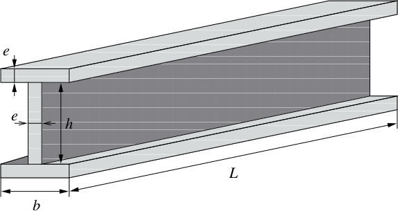
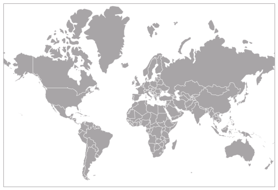

# Modelling optimisation problems

[« Previous](.) \| [Home ↑](..) \| [Next »](.)

## The aircraft wing design problem

An aircraft design engineer comes to you and asks: "In the design department, we usually draw plans of the plane's wings and then try out different I-beam shape factors to test if they can resist the buckling loads suffered in-flight. But we're never really sure that we have the lightest possible beam and that is a problem since the lighter our beams are, the better our plane's propulsion performance. We've heard you mathematicians can help us find the best I-beam shapes."

## The mapmaker dilemma

A local airline operates on a network of few major European cities. In order to optimise their routes and schedules, they drew all possible options on a Mercator projection map, but that projection did not work well. They come to you as they wish to place cities on a new map where their positions best fits inter-city distances.

## Scope of the course

Both of these problems are optimisation problems. They correspond to situations where one wishes to find the best configuration among many possible solutions. The job of the optimisation scientist or engineer is to:

- transform such plain words formulations into mathematical descriptions,
- identify to what category of optimization problem they belong, in order to design the most appropriate resolution method, or choose the best off-the-shelf numerical tool to solve it,
- put it back into words and comment it so that the solution is usable.

In this class, we focus on a particular class of optimization problems which can be cast using only **continuous variables** and for which we can write the optimization criterion as a **differentiable function**.

The optimization criterion is called the **objective function** and the variables that describe our different options are called **decision variables**.

Suppose we write $x$ the vector of problem variables and $f$ the objective function. The differentiable optimization problem is to find the value(s) of $x$ that minimize $f$:

$$\min_{x\in \mathbb{R}^n} f(x)$$

<b>Exercice:</b> 
Write the set of variables for each of the two introductory problems. Write the objective function.

    
<b>1. The aircraft wing design problem</b> (click to unfold)
    

    
 We want to find the best beam shape and $L$ is fixed because it depends on the wing's geometry, so (based on the drawing provided by the design department) our variables are $x=(e,h,b)$.

    
 What the design department wants, is to find the lightest possible beam. So they want to minimize the beam mass. Apparently, they didn't talk about changing the steel alloy they're using (only the beam shape), so we will assume a constant density $\rho$. Therefore, the problem turns out to be the minimization problem:

    $$f(x) = \rho L \left( 2eb+eh \right)$$

    
Note that $\rho$ and $L$ are fixed (provided by the engineering department).

    
<b>2. The mapmaker dilemma</b> (click to unfold)
    

    
Drawing a map consists in finding the cities' coordinates. Let's call $(x_c,y_c)$ the coordinates of city $c$ and let's call $[1,C]$ the integer interval of city indices. The vector of decision variables is then $x = (x_0,y_0, \ldots, x_C,y_C)$.

    
We want to draw a map that respects the inter-city distances. We shall write $d_{ij}$ the distance between cities $i$ and $j$ ($(i,j)\in [1,C]^2$).

    
So for each pair $(i,j)$, we want the two points $(x_i,y_i)$ and $(x_j,y_j)$ to be $d_{ij}$ apart.

    
The distance between these two points is

    $$d(i,j) = \sqrt{\left(x_i-x_j\right)^2 + \left(y_i-y_j\right)^2}$$

    
So we want the difference $d(i,j) - d_{ij}$ to be as close to zero as possible. We can get rid of this ugly square root and write that it is equivalent to making the difference $d(i,j)^2 - d_{ij}^2$ as close to zero as possible. Consequently, we want to minimize the quantity $\left(d(i,j)^2 - d_{ij}^2\right)^2$ and we want to minimize it for all pairs of cities. So our objective function is:

    $$f(x) = \sum\limits_{i=1}^C \sum\limits_{j=1}^C \left(\left(x_i-x_j\right)^2 + \left(y_i-y_j\right)^2 - d_{ij}^2\right)^2$$

    
It is interesting to note that in the sum above, the same term appears twice: for the pairs $(i,j)$ and $(j,i)$. We can simplify our objective function by writing:

    $$f(x) = \sum\limits_{i=1}^C \sum\limits_{j=i+1}^C \left(\left(x_i-x_j\right)^2 + \left(y_i-y_j\right)^2 - d_{ij}^2\right)^2$$

## Constraint optimisation

Often, when writing the decision variables and the objective function, we realize they are not sufficient to model our problem. For instance, in the aircraft wing design problem, we have an obvious, easy to manufacture, beam that minimises $\left( 2eb+eh \right)$, that is $e=0$: zero thickness, then the volume is minimised, but it is not certain that was an acceptable beam for the design department. What is missing is some restriction on the set of beams we look for.

In this particular example, the reason this zero-thickness beam is not acceptable is that it won't resist the in-flight buckling loads. When we ask the design department how we can express such resistance requirements, they answer that the load that can be handled by the beam can be written $\dfrac{\pi^2 E I}{L^2}$ where $I$ is the beam's moment of inertia $I = e\dfrac{h^2}{2}\left(\dfrac{h}{6}+b\right)$.

Additionally, their previous calculations provide a value $P_{max}$ for the worst-case load suffered in flight. Consequently, we need our beam to respect:

$$P_{max}\leq \frac{\pi^2 E}{L^2} e\frac{h^2}{2}\left(\frac{h}{6}+b\right)$$

Such a relation is what we call a <b>constraint</b>. A constraint is an equality or an inequality involving the decision variables, that reduces the set of acceptable solutions for our optimisation problem.

Suppose the design department also tell us they cannot manufacture beams with a thickness smaller than $e_{\mathrm{min}}$ and they need to have a beam's tail $b$ that is always equal to $10\,e$.

Then globally, our design problem can be modelled as:

$$
\left\{\begin{array}{c}
\min\limits_{(e,h,b) \in \mathbb{R}^3} \rho L \left( 2eb+eh \right)\\
P_{\mathrm{max}}\leq \frac{\pi^2 E}{L^2} e\frac{h^2}{2}\left(\frac{h}{6}+b\right)\\
e\geq e_{\mathrm{min}}\\
b = 10\,e
\end{array}\right.
$$

The general case of optimisation problems we consider will be written:

$$
\left\{\begin{array}{c}
\min_x f(x)\\
h(x) \leq 0\\
g(x) = 0
\end{array}\right.
$$

In the example above, we have:

$$
h(e,h,b) = \left( \begin{array}{l} P_{max} - \frac{\pi^2 E}{L^2} e\frac{h^2}{2}\left(\frac{h}{6}+b\right)\\ e_{min}-e
\end{array}\right)
$$

And :
$$g(e,h,b) = b-10e$$

    <b>Scope of the course:</b>
    
This section will focus on problems using only continuous variables and for which we the objective function and constraints are all differentiable functions. (We will however put constraints aside because of time constraints we have in the course!)

    
We can these problems <em>non-linear</em> because we do not make any assumptions (besides differentiability) on $f$, $g$ or $h$. By contrast, linear programming will focus on the specific case of functions which can be written as a linear combination of variables.

<b>One final question:</b> 
Does the map reconstruction problem have constraints?

    
<b>Solution</b> (click to unfold)

    
No

    
However, it is interesting to remark that the optimal solution is not unique. Suppose you know an optimal assignment for $x = (x_0,y_0, \ldots, x_C,y_C)$; now translate and/or rotate these points in the $(x,y)$-plane, you still have an optimal solution. Maybe forcing a first city's coordinates to $(0,0)$ and forcing the general map orientation will help make the solution unique.

    
Eventually, introducing those constraints can prove useful.

[« Previous](.) \| [Home ↑](..) \| [Next »](.)
