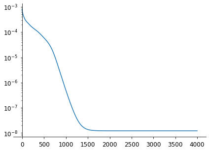
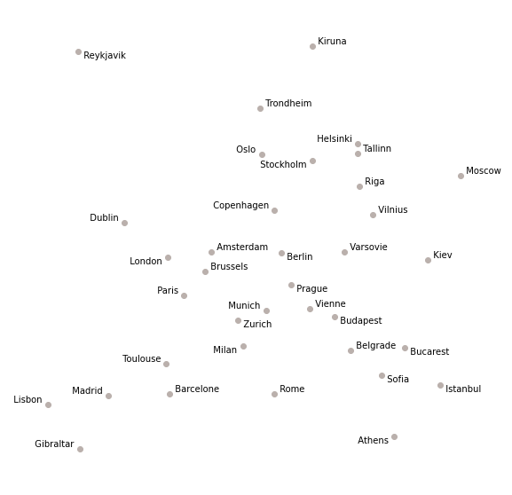

# Automatic differentiation

[« Previous](./introduction) \| [Up ↑](.) \| [Next »](./optim)

There are basically two additional functionalities provided by tensors:

1. you can send them to GPU for faster parallel computations (but avoid Python functions and loops like the plague and focus on torch implementations to really benefit from them);

```python
# we use "cpu" if we don't want to make things complicated
>>> torch.ones(1, device=0)
tensor([1.], device='cuda:0')
```

2. (the most precious) computations propagate their gradient values!

```python
>>> x0 = torch.ones(1, requires_grad=True)
>>> y0 = x0 ** 2
>>> y0.backward()
>>> x0.grad
tensor([2.])
```

<div class="alert alert-warning"><b>Exercice:</b><br/>
    Can you confirm you really expected the value 2 here?
</div>

<details><summary><b>Solution</b> (click to unfold)</summary>
    The derivative of the function $x \mapsto x^2$ is $x \mapsto 2\,x$ which evaluates to 2 for $x=1$.
</details>

So let's now come back to the initialisation of our city placement problem:

```python
import numpy as np

cities = [
    'Amsterdam', 'Athens', 'Barcelone', 'Belgrade', 'Berlin',
    'Brussels', 'Bucarest', 'Budapest', 'Copenhagen', 'Dublin',
    'Gibraltar', 'Helsinki', 'Istanbul', 'Kiev', 'Kiruna',
    'Lisbon', 'London', 'Madrid', 'Milan', 'Moscow', 'Munich',
    'Oslo', 'Paris', 'Prague', 'Reykjavik', 'Riga', 'Rome',
    'Sofia', 'Stockholm', 'Tallinn', 'Toulouse', 'Trondheim',
    'Varsovie', 'Vienne', 'Vilnius', 'Zurich'
]
n = len(cities)
distances = np.load("distances.npy")
```

```python
# initial random position
x0 = np.random.normal(size=(n, 2))

# normalize distance matrix
l1, l2 = np.meshgrid(x0[:, 0], x0[:, 0])
r1, r2 = np.meshgrid(x0[:, 1], x0[:, 1])
x0 /= np.linalg.norm(np.sqrt((l1 - l2) ** 2 + (r1 - r2) ** 2))
distances /= np.linalg.norm(distances)
```

Things will not change much with PyTorch: but we will not fail to specify that we don't want to compute the gradient, because it was really tedious.

Let's attach the distance matrix to the GPU for our computation, but apart from that, the API is really similar:

```python
distances = torch.Tensor(distances).to(0)
distances /= torch.linalg.norm(distances)
```

Let's put this all in a function as we are going to reinitialise it several times in the following:

```python
def init_t0():
    t0 = torch.randn(
        (n, 2), dtype=float, requires_grad=True, device=0
    )

    with torch.no_grad():
        l1, l2 = torch.meshgrid(t0[:, 0], t0[:, 0])
        r1, r2 = torch.meshgrid(t0[:, 1], t0[:, 1])
        t0 /= torch.linalg.norm(
            torch.sqrt((l1 - l2) ** 2 + (r1 - r2) ** 2)
        )

    return t0


t0 = init_t0()
```

This implementation we had is a bit awkward for torch, so let's benefit from the `cdist` function which computes exactly the same code, without the (buzzkill) loop:

```python
def criterion(*args):
    """Compute the map reconstruction objective function.

    Vector reshaped for more readability.
    """
    res = 0
    x = np.array(args).reshape((n, 2))  # tuple -> np.array (2D)
    for i in range(n):
        for j in range(i + 1, n):
            (x1, y1), (x2, y2) = x[i, :], x[j, :]
            delta = (
                (x2 - x1) ** 2 + (y2 - y1) ** 2
                - distances[i, j] ** 2
            )
            res += delta ** 2
    return res
```

```python
def criterion(x: torch.Tensor):
    delta = torch.cdist(x, x) ** 2 - distances ** 2
    return (delta ** 2).sum() / 2

loss = criterion(t0)
loss
# tensor(0.0007, device='cuda:0', dtype=torch.float64, grad_fn=<DivBackward0>)
```

We named the variable loss here, because that is the metric we usually want to minimise in a neural network. Here, we basically implemented a distance based loss. And the great thing, is that we got the gradient for free!

```python
>>> loss.backward()
>>> t0.grad
tensor([[ 1.6303e-03,  1.2010e-04],
        [ 2.7972e-05, -4.3371e-05],
        # truncated
        [-1.4092e-03, -2.6484e-03],
        [ 1.2767e-03, -4.2169e-04],
        [-2.3571e-03,  7.6526e-03],
        [-3.6612e-04, -4.5860e-04]], device='cuda:0', dtype=torch.float64)
```

So let's give it a first shot with a naive constant step (we call it a _learning rate_) gradient descent:

```python
from tqdm import tqdm

n_epochs = 4000
learning_rate = 1e-1

loss_values = list()
t0 = init_t0()

for i in tqdm(range(n_epochs)):

    loss = criterion(t0)
    loss.backward()

    # bring the loss back to Earth
    loss_values.append(loss.cpu().detach().numpy().item())

    # we need this guard because we want to update t0 based on
    # its gradient which would change its gradient, so let's
    # stop keeping track of gradient
    with torch.no_grad():
        t0 -= learning_rate * t0.grad
        t0.grad.zero_()
```

    100%|█████████████████████| 4000/4000 [00:05<00:00, 725.82it/s]

We can check the convergence of the algorithm (it is common practice to have it in semi-log).

```python
import matplotlib.pyplot as plt

fig, ax = plt.subplots(figsize=(7, 5))
ax.semilogy(loss_values)

ax.spines["right"].set_visible(False)
ax.spines["top"].set_visible(False)
ax.spines["left"].set_position(("data", 0))
ax.tick_params(pad=5, labelsize=12)
```



It is quite slow actually... so much for GPU!  
Remember we converged within 34 iterations with SciPy BFGS, but we have things in place, and we can confirm city placement is correct:

```python
fig, ax = plt.subplots(figsize=(10, 10))
plot_cities(ax, t0)
```



[« Previous](./introduction) \| [Up ↑](.) \| [Next »](./optim)
