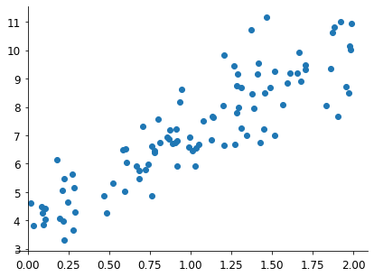

# Exercice: Linear regression

[« Previous](./optim) \| [Up ↑](.) \| [Next »](../4_linear/)

Regression is a more traditional ML problem. We can show here how to address a simple version of the problem (which also has an analytical solution) with an optimisation method like ADAM.

```python
x = 2 * torch.rand(100, 1, device=0)
y = 3 * x + 4 + torch.randn(100, 1, device=0)

fig, ax = plt.subplots(figsize=(7, 5))
ax.scatter(x.cpu(), y.cpu())

ax.spines["right"].set_visible(False)
ax.spines["top"].set_visible(False)
ax.spines["left"].set_position(("data", 0))
ax.tick_params(pad=5, labelsize=12)
```



1. Start by generating sample points around a straight line, as below
2. Implement the metric (loss) you need to optimise;
3. Try different initial learning rate values and observe the convergence behaviour;
4. Look at the convergence process in the animations below: can you explain what happened with the learning rate values?

   - Situation 1<br/>
     <video src="adam_5e-1.mp4" controls width="100%"> </video>
   - Situation 2<br/>
     <video src="adam_6e-2.mp4" controls width="100%"> </video>
   - Situation 3<br/>
     <video src="adam_1e-2.mp4" controls width="100%"> </video>
