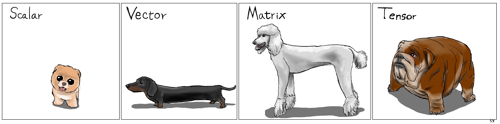

# Introduction to tensors

[« Previous](.) \| [Up ↑](.) \| [Next »](./autograd)

In the previous section, we used NumPy to manipulate arrays of float and SciPy for optimisation methods after we gave a shot at implementing basic gradient descent me

- a zero-dimension array would be called a **scalar**;

  ```python
  >>> np.zeros(())  # the empty tuple
  array(0.)
  ```

- one-dimension would be a **vector**;

  ```python
  >>> np.zeros((5,))  # or np.zeros(5)
  array([0., 0., 0., 0., 0.])
  ```

- two-dimension a **matrix**;

  ```python
  >>> np.zeros(5, 5)
  array([[0., 0., 0., 0., 0.],
         [0., 0., 0., 0., 0.],
         [0., 0., 0., 0., 0.],
         [0., 0., 0., 0., 0.],
         [0., 0., 0., 0., 0.]])
  ```

In the general case, we call such a structure a **tensor**.



Image credit: [http://karlstratos.com/#drawings](http://karlstratos.com/#drawings)


Well, yes, that's all, of course. But there's more.

While it is true that we could train neural networks with NumPy arrays (it is really not complicated – but out of topic here), the point of libraries like PyTorch is to bring more than what NumPy already provides.

But to start with, PyTorch provides all what NumPy does. So a NumPy array is (like) a PyTorch tensor.

```python
>>> import torch

>>> torch.zeros(())
tensor(0.)

>>> torch.zeros(5)
tensor([0., 0., 0., 0., 0.])

>>> torch.zeros(5, 5)
tensor([[0., 0., 0., 0., 0.],
        [0., 0., 0., 0., 0.],
        [0., 0., 0., 0., 0.],
        [0., 0., 0., 0., 0.],
        [0., 0., 0., 0., 0.]])
```

[« Previous](.) \| [Up ↑](.) \| [Next »](./autograd)
