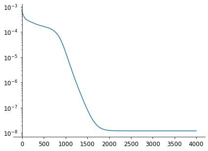
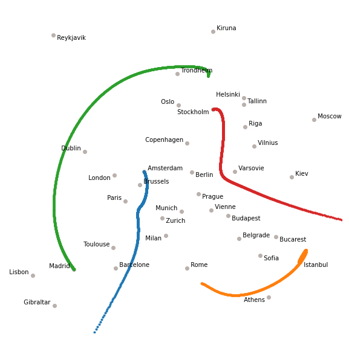
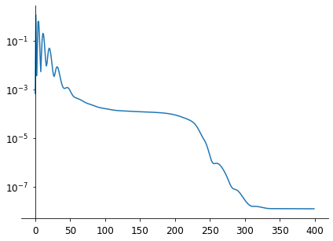
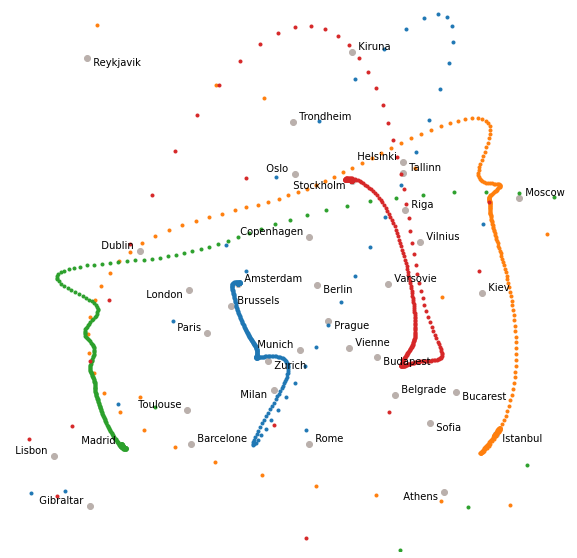
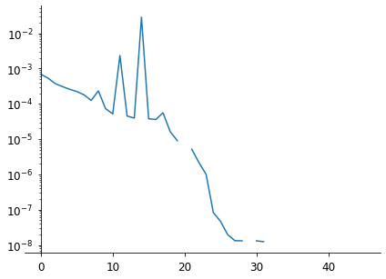
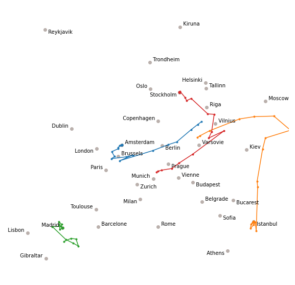

# Optimisers in PyTorch

[« Previous](./autograd) \| [Up ↑](.) \| [Next »](./exercice)

Many optimisation engines are implemented in PyTorch: these are not necessarily the most appropriate for a wide range of problems, but these methods usually work well for the optimisation of neural networks.

## Stochastic Gradient Descent

The most famous method is the _Stochastic Gradient Descent_ (SGD): instead of evaluating the gradient on all samples of our training dataset, we estimate the gradient based on a subset of samples. This method sounds very naive but it happens to work well with neural networks.

In our city problem, we have few samples, so we pass them all at each epoch, and our SGD is just a fixed step gradient descent.

```python
from torch import optim


n_epochs = 4000
loss_values = list()
history = list()

t0 = init_t0()
optimizer = optim.SGD([t0], lr=1e-1)


for i in tqdm(range(n_epochs)):

    loss = criterion(t0)
    loss.backward()
    loss_values.append(loss.cpu().detach().numpy().item())
    history.append(t0.cpu().detach())

    optimizer.step()
    optimizer.zero_grad()
```

    100%|███████████| 4000/4000 [00:05<00:00, 753.11it/s]

```python
fig, ax = plt.subplots(figsize=(7, 5))
ax.semilogy(loss_values)

ax.spines["right"].set_visible(False)
ax.spines["top"].set_visible(False)
ax.spines["left"].set_position(("data", 0))
ax.tick_params(pad=5, labelsize=12)
```



The convergence is rather slow according to the loss, because of the fixed learning rate, and we can see from the trajectory of few cities how the convergence is going (there is one point per epoch).

```python
fig, ax = plt.subplots(figsize=(10, 10))
h = plot_cities(ax, t0, history)

ax.plot(*torch.concat(h).reshape(-1, n, 2)[:, 0, :].T, '.')
ax.plot(*torch.concat(h).reshape(-1, n, 2)[:, 12, :].T, '.')
ax.plot(*torch.concat(h).reshape(-1, n, 2)[:, 17, :].T, '.')
ax.plot(*torch.concat(h).reshape(-1, n, 2)[:, 28, :].T, '.')
```



## ADAM

**ADAM** stands for _Adaptive Moment Estimation_ and is a good default optimiser for neural networks. It works well with large problems consisting of many parameters and requiring a lot of data in input.

The method controls the learning rate during the optimisation so that there is minimum oscillation when it reaches the global minimum while taking big enough steps along the way.

```python
from torch import optim

n_epochs = 400
loss_values = list()
history = list()

t0 = init_t0()
optimizer = optim.Adam([t0], lr=1e-1)


for i in tqdm(range(n_epochs)):

    loss = criterion(t0)
    loss.backward()
    loss_values.append(loss.cpu().detach().numpy().item())
    history.append(t0.cpu().detach())

    optimizer.step()
    optimizer.zero_grad()
```

    100%|█████████████| 400/400 [00:01<00:00, 359.78it/s]

```python
fig, ax = plt.subplots(figsize=(7, 5))
ax.semilogy(loss_values)

ax.spines["right"].set_visible(False)
ax.spines["top"].set_visible(False)
ax.spines["left"].set_position(("data", 0))
ax.tick_params(pad=5, labelsize=12)
```



The convergence is very chaotic in the first iterations (with a loss oscillation!) but it converges very fast after that.

```python
fig, ax = plt.subplots(figsize=(10, 10))
h = plot_cities(ax, t0, history)

ax.plot(*torch.concat(h).reshape(-1, n, 2)[:, 0, :].T, '.')
ax.plot(*torch.concat(h).reshape(-1, n, 2)[:, 12, :].T, '.')
ax.plot(*torch.concat(h).reshape(-1, n, 2)[:, 17, :].T, '.')
ax.plot(*torch.concat(h).reshape(-1, n, 2)[:, 28, :].T, '.')
```



## BFGS

**BFGS** was the method leading to the fastest convergence. It is also available in PyTorch as a variant (**L-BFGS**) which is an approximation to BFGS which requires less memory.

The method needs to estimate the gradient several times at each epoch, so we plot here the trajectory after each gradient estimation rather than at each epoch (the problem converges after 2 or 3 epochs...)

```python
from torch import optim

n_epochs = 10
loss_values = list()
history= list()

t0 = init_t0()
optimizer = optim.LBFGS([t0])


def closure():
    optimizer.zero_grad()
    loss = criterion(t0)

    loss_values.append(loss.cpu().detach().numpy().item())
    history.append(t0.cpu().detach())

    loss.backward()
    return loss


for i in tqdm(range(n_epochs)):
    loss = optimizer.step(closure)
    loss_values.append(None)
    optimizer.zero_grad()
```

    100%|████████████████| 10/10 [00:00<00:00, 39.39it/s]

```python
fig, ax = plt.subplots(figsize=(7, 5))
ax.semilogy(loss_values)

ax.spines["right"].set_visible(False)
ax.spines["top"].set_visible(False)
ax.spines["left"].set_position(("data", 0))
ax.tick_params(pad=5, labelsize=12)
```



```python
fig, ax = plt.subplots(figsize=(10, 10))
h = plot_cities(ax, t0, history)

ax.plot(*torch.concat(h).reshape(-1, n, 2)[:, 0, :].T, '.-')
ax.plot(*torch.concat(h).reshape(-1, n, 2)[:, 12, :].T, '.-')
ax.plot(*torch.concat(h).reshape(-1, n, 2)[:, 17, :].T, '.-')
ax.plot(*torch.concat(h).reshape(-1, n, 2)[:, 28, :].T, '.-')
```



[« Previous](./autograd) \| [Up ↑](.) \| [Next »](./exercice)
