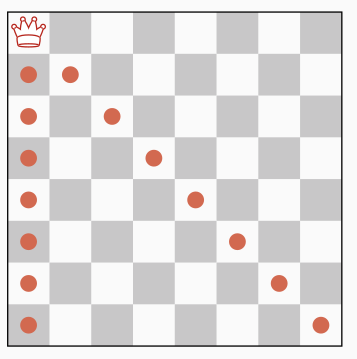

# Constraint programming

[« Previous](./problems) \| [Up ↑](.) \| [Next »](.)

## Definition

A _constraint satisfaction problem_ consists of:

- a finite set of variables $x_1,... x_n$;
- a corresponding set of finite domains $d_1, ... d_n$;
- a finite set of constraints over subsets of variables, i.e. relations
  expressing _which assignations of variables to values are acceptable_.

The objective is to find an instantiation of values to variables within their
domains, which satisfies all the expressed constraints.

A problem of two variables $x, y \in \{0, 1, 2\}$ subject to the constraint
$x \neq y$ is a constraint satisfaction problem.

- Unlike _Linear Programming_, there is no restriction on the nature of
  constraints as long as the solver is able to determine for any instantiation if
  it violates any of the constraints stated.^[If you can explain the constraint
  with words in proper English, you can probably state it using constraint
  programming.]
- It is **not** possible to manipulate infinite domains.
- In theory, the domains can be formed of _anything_. However, it is a common
  practice to associate these pieces of _anything_ with finite sets of integers.

## Illustrative problems

$$
\begin{alignat*}{12}
&&&&&&\sf{}S&&\sf{}E&&\sf{}N&&\sf{}D\\
&&+&&&&\sf{}M&&\sf{}O&&\sf{}R&&\sf{}E\\
=&&&&\sf{}M&&\sf{}O&&\sf{}N&&\sf{}E&&\sf{}Y
\end{alignat*}
$$

<b>Exercice:</b> 
Which digits can we use to replace the following letters so that the addition stands true?

<b>Solution</b> (Click to unfold)

Each letter can be associated to a variable taking values between 0 and 9. All variables are linked by the following arithmetic constraint $\mathsf S \times 1000 + \mathsf E \times 100 + ... = ... + \mathsf E \times 10 + \mathsf Y$.

{:.half}

<b>Exercice:</b> 
Place 8 queens on a board so that no two queens attack each other.

<b>Solution</b> (Click to unfold)

Eight variables $q_i$ represent the position of the queen placed on the row labeled $i$. All variables must be different (not on the same column). Also, no two queens may be placed on the same ($\nearrow$ and $\searrow$) diagonal.

<b>Exercice:</b> 
How to colour each region of the attached map, so that no two neighbouring regions hold the same colour? The problem consists in finding a colouring that minimises the number of colours used to paint the map.

<b>Solution</b> (Click to unfold)

Each region is mapped to a colour (integer) taking values between 1 and n. A different ($\neq$) constraint is stated over all regions that are neighbouring.

You may recall the mathematical theorem stating that at most four colours are necessary for a proper colouring of such maps.
We can use $n=4$ for a _start_ (upper bound) and choose to decrease $n$ until no solution is found.

A more complicated---albeit general---approach would be to add an minimising criterion (optimisation) on the total number of colours used in a satisfying colouring.

## The resolution process

Constraints as we state them do not necessarily apply to all variables which we use to define the problem.  
Each constraint is associated with:

- its _scope_, i.e. the set of variables it applies on;
- its _arity_, i.e. the number of variables it applies on.

A common resolution process implements a _depth-first search_ algorithm in a tree that is built _on the fly_:

- We first choose an ordering over the variables: $x_1, x_2, \cdots x_n$;
- The first branch of the first level of the tree maps to the instantiation of the first possible value of variable $x_1$. From this node, the first branch (of the second level) of the tree maps appends to the preceding _partial instantiation_ the instantiation of the first possible value for variable $x_2$;
- The algorithm stops when it reaches a leaf (a.k.a. full instantiation) which violates no constraint.
- At each node (a.k.a. partial instantiation), the algorithm checks the validity of all constraints whose scope is included in the set of already assigned variables:
  - if no conflict is raised, the search goes _deeper_ and a new variable is assigned;
  - if a conflict is raised, the search goes _backward_ and invalidates the assumptions already made.

- The choice of the variable and/or value order can have a significant impact on the size of the tree, i.e. on the resolution time. Some heuristics (e.g., choose first the variable with the smaller domain) may yield better performance.
- Do keep in mind that no tree is actually built in memory: the branching is made _on the fly_ and the tree representation only illustrates the algorithm.

## A word about arc-consistency

In the worst case, the tree is of an exponential size: efficient algorithms try to prune sub-trees _as early as possible_ in the depth-first search process.

The basic backtracking algorithm we implemented on the toy problem shows several issues:

- the domain of $x_3$ should be limited to $\{1, 2, 3\}$ to avoid countless instantiations of value $0$ to variable $x_3$ and subsequent backtracking.
- a similar domain reduction should be implemented on _binary constraints_. If $c_1: x_1 \neq x_2$, assigning value $0$ to $x_1$ should remove $0$ from the domain of $x_2$ in the sub-tree rooted in $(0,\cdot,\cdot)$.

<b>Important!</b> 
This step is called <b>constraint propagation</b> and is something we as humans are very capable at doing (unlike a search tree). In fine, Constraint programming is all about alternating hypotheses (branching) and constraint propagation (pruning).

A basic implementation of _constraint propagation_ consists of _maintaining arc-consistency_, i.e. pruning the domains of variables which are not yet assigned but linked to assigned variables through binary constraints.

We can illustrate the benefits of this _forward-checking_ approach with the 8-queen problem. When the first (red) queen is placed, we prune the domain of all the other queens (red dots).

{:.half}

Then, instead of trying position 1 and 2, the second (green) queen is directly placed on the first value of its subsequent domain, i.e. position 3.

{:.half}

When the third (blue) queen is placed, the domain of the sixth queen is reduced a single value (i.e. position 4);

{:.half}

however, the placement of the fourth (violet) queen eliminates all values of the domain of this queen. A backtrack can be triggered at that point.

{:.half}

Note that with this arc-consistency technique, the first backtrack occurs for instance $(1,3,5,2,\cdot,\cdot,\cdot,\cdot)$. Without this optimisation, we would have already backtracked 7 times before reaching this partial instantiation, and would still need to make several attempts/backtracks for queens #5 and #6 before realising they lead to no solution.

_There are many algorithms designed to maintain arc-consistency and detect irrelevant sub-trees as soon as possible._

## Symmetries

Consider the n-queen problem. A chessboard that is rotated by 90°, 180° or 270° yields queens positions that are different yet equivalent.

If the former chessboard is a solution to our problem, the latter also is. Conversely, if the former violates any constraint, the latter does so as well. A mirrored chessboard follows the same logics.

Formally speaking, a symmetry may be a permutation on the variables ($q_1 \rightleftharpoons q_4$) and/or on the values ($1 \rightleftharpoons 4$) of the problem.

{:.full}

There are several ways to exploit the symmetries of a problem:

- _reformulate a problem_ into a simpler one without symmetries. The tree to be searched is of a smaller size than the symmetrical one, leading to significantly better performance.  
  As a matter of fact, it is important to find a good balance when writing models: avoid symmetries yet still be readable.

- _add constraints_ to the problem so as to break the symmetries. The constraints may be added statically (before the search) or dynamically (during the search by the solver).  
  _Tip:_ when several variables $x_i$ can be swapped in a problem, consider constraining them with an ordering: $x_1 \leq x_2 \leq \cdots x_n$.

- the solver may dynamically _use symmetry information during search_: if the depth-first search process hits a partial instantiation that is symmetrical to an instantiation which already triggered a backtrack, then it is of no use to go deeper: the solver backtracks.

_The bottom line when considering symmetries is to only try to exploit them if detecting them costs less than the speedup you can get from exploiting them._

[« Previous](./problems) \| [Up ↑](.) \| [Next »](.)
