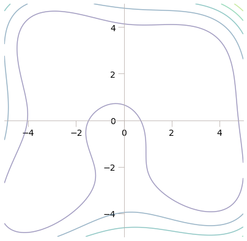
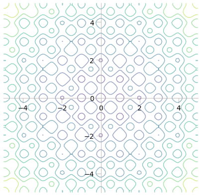
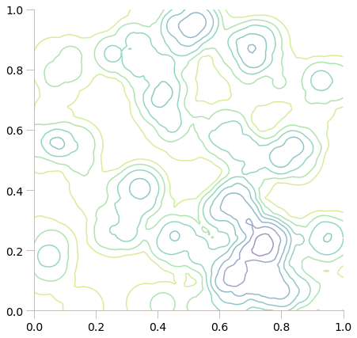

# A bestiary of functions

[« Previous](.) \| [Up ↑](.) \| [Next »](./annealing)

File `bestiary.py` provides implementations for three famous functions which are challenging for optimisation methods.

```python
from bestiary import *
```

## Himmelblau's function

**Himmelblau's function** has four identical local minima, including one in $(3, 2)$. It is defined as:

$$f(x, y) = (x^2+y-11)^2 + (x+y^2-7)^2$$

```python
vec = np.linspace(-5, 5, 100)
X, Y = np.meshgrid(vec, vec)
contour_function(himmelblau, X, Y)
```



```python
animate_function(himmelblau, X, Y)
```

<video src="himmelblau.mp4" controls width="100%"> </video>

<div style="margin: 1em"></div>

## Rastrigin's function

**Rastrigin's function** is a typical example of non-linear multimodal function, which generalises in $n$ dimensions. Finding the minimum of this function is a fairly difficult problem due to its large search space and its large number of local minima.

```python
vec = np.linspace(-5, 5, 100)
X, Y = np.meshgrid(vec, vec)
contour_function(rastrigin, X, Y)
```



```python
animate_function(rastrigin, X, Y)
```

<video src="rastrigin.mp4" controls width="100%"> </video>

<div style="margin: 1em"></div>

## Boulders

This function is a fun one to compute: imagine a handful of boulders hitting a plane, leaving a hole of a determined depth. If you know where the boulders hit, it is relatively easy to find the global minimum, but it is a good one to generate always new functions for challenging your algorithms.

```python
vec = np.linspace(0, 1, 100)
X, Y = np.meshgrid(vec, vec)
b = boulders(64)  # the number of boulders
contour_function(b)
```



```python
animate_function(b, X, Y)
```

<video src="boulders.mp4" controls width="100%"> </video>

[« Previous](.) \| [Up ↑](.) \| [Next »](./annealing)
